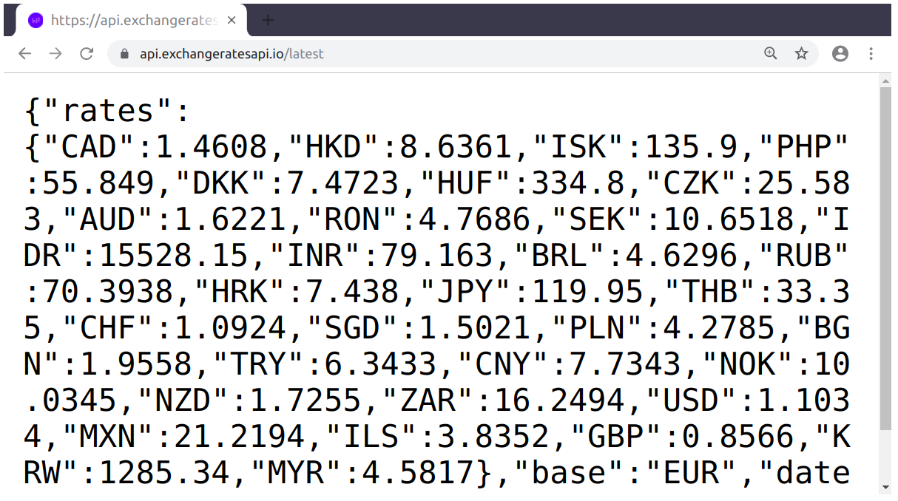

```{r setup, include=FALSE}
knitr::opts_chunk$set(echo = TRUE,comment = '#>',message = F, out.width = '70%', fig.align='center')
```

```{r klippy, echo=FALSE, include=TRUE}
klippy::klippy(position = c('top', 'right'),color = 'darkred', lang=c('r', 'txt'))
```


## HTTP

- HTTP 是網路上，電腦與電腦 (伺服器) 之間進行溝通時，所遵循的一套規則。當你在瀏覽器當中輸入一個網址 (URL) 時，你的瀏覽器會幫你向位於該 URL 的伺服器發出一個 **HTTP request**。伺服器收到這個 HTTP request 之後，會解讀它，並依據解讀的結果，向你的電腦送出 **HTTP response**。若一切正常運作，HTTP response 應會包含你想要的內容 (e.g. 某個網頁)。你的瀏覽器在接收到 HTTP response 之後，會解讀它並將其所包含的內容 (e.g. HTML) (經處理後) 呈現在螢幕上。
    
{.half style='width:45%'}

- 通常，我們輸入網址後所收到的內容是 HTML 格式，因此我們在瀏覽器解讀 HTML 後，會在螢幕呈現出一個 (漂亮的) 網頁。但不一定所有網址都會回傳 HTML 的格式，有時候會是其它格式，例如 JSON 格式 (<https://api.exchangeratesapi.io/latest>) 或是 `text/plain` (<https://rlads2019.github.io/hw8/idioms.txt>)。這時，瀏覽器上就會呈現出純文字的樣子:

{.half style='width:55%'}


- 伺服器回傳 JSON 格式不是為了 (直接) 給人看的，而是為了**方便程式與電腦處理**。換言之，位在這個 URL 的伺服器希望使用者**透過程式與自己互動**，因此它不提供一個漂亮的界面 (i.e. 網頁)，而是提供一個 [Web API](https://en.wikipedia.org/wiki/Web_API)，讓使用者可以透過程式語言直接取得乾淨、結構化的資料。


## URL 的結構

- Web API 的設計常是透過讓使用者在 URL 加上一些訊息 (query string)，藉此得知使用者想取得哪些資料。
    - 例如，[Foreign exchange rates API](https://exchangeratesapi.io) 透過使用者在 URL 之後加上的 `start_at=<date>` 以及 `end_at=<date>`，判斷回傳的資料所需包含的時間範圍: `https://api.exchangeratesapi.io/history?start_at=2018-01-01&end_at=2018-09-01`

- URL 當中的 query string 具有一些特殊的結構。query string 讓使用者可以提供一或多個 key-value pairs (需看 API 說明文件)。例如，上方例子中的 `start_at` 與 `end_at` 即為 key-value pairs 中的 key，在 key 與 value 之間則用 `=` 分隔。詳見下圖的 URL 結構。

{.half}


## `httr`


